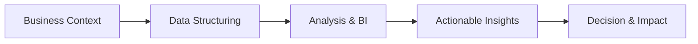

<h1 align="center">Hi, I'm Sarah Zanardi 👋</h1>
<h3 align="center">Data & BI Analyst | Product Owner | Data Engineering</h3>

  Data-driven professional focused on turning complex data into strategic decisions and scalable solutions.

  
  

  
  
  

---

## Quick Navigation
- [About Me](#about-me)
- [How I Work](#how-i-work)
- [Core Expertise](#core-expertise)
- [Tech Stack](#tech-stack)
- [What I Deliver](#what-i-deliver)
- [Mindset](#mindset)
- [Connect With Me](#connect-with-me)

---

## About Me
I work at the intersection of **business, analytics, and data engineering**, creating solutions that improve operational efficiency and support better decisions.

My approach combines **analytical thinking + data architecture + business context**, ensuring data is not only available, but truly actionable.

---

## How I Work

---

## Core Expertise

  
<strong>Business Intelligence & Analytics</strong>

- KPI definition and performance monitoring
- Operational and financial analysis
- Exploratory Data Analysis (EDA)

  
<strong>Data Engineering & Architecture</strong>

- Data modeling and analytical structures
- Data Lake and Data Warehouse concepts
- ETL / ELT pipeline structuring

  
<strong>Product & Business Strategy</strong>

- Stakeholder management
- Data-driven decision-making
- Process mapping and optimization

---

## Tech Stack
### Programming

### Cloud & Platforms

### Data Visualization

---

## What I Deliver
- Structured and reliable data environments
- Scalable data pipelines
- Clear and actionable insights
- Business-oriented analytics

---

## Mindset
**Data is only valuable when it drives decisions.**

I focus on building well-structured data foundations, enabling efficient analysis, and delivering insights that generate real business impact.

---

## Connect With Me
- LinkedIn: [linkedin.com/in/sarah-zanardi-](https://www.linkedin.com/in/sarah-zanardi-)
- GitHub: [github.com/SarahZanardi](https://github.com/SarahZanardi)
