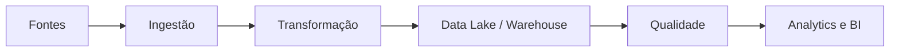

# Sarah Zanardi

### Data Engineer · Analytics · BI

Construo pipelines e estruturas de dados confiáveis para transformar informação em decisões melhores.

## Em poucas palavras

| Foco | Como contribuo |
| --- | --- |
| **Engenharia de Dados** | ETL/ELT, integração, transformação e automação |
| **Plataformas de dados** | Data Lake, Data Warehouse e modelagem analítica |
| **Analytics & BI** | Dados confiáveis para KPIs, dashboards e decisões |
| **Negócio** | Requisitos claros, comunicação e impacto mensurável |

## O que faço

Atuo na interseção entre **engenharia, análise e negócio**. Organizo dados desde a origem até o consumo, com atenção à qualidade, documentação, rastreabilidade e facilidade de manutenção.

```mermaid
flowchart LR
    A[Fontes] --> B[Ingestão]
    B --> C[Transformação]
    C --> D[Data Lake / Warehouse]
    D --> E[Qualidade]
    E --> F[Analytics e BI]
```

## Stack principal

### Linguagens e análise

### Cloud e plataformas de dados

### Entrega de valor

## Competências

- Construção e organização de pipelines **ETL/ELT**
- Modelagem dimensional e estruturas analíticas
- Integração, tratamento e padronização de dados
- Validação de indicadores e definição de KPIs
- Documentação, qualidade e governança de dados
- Comunicação com stakeholders e entendimento de requisitos

## O que busco construir

Soluções de dados **confiáveis, escaláveis e fáceis de consumir**: processos automatizados, dados bem modelados e informações prontas para apoiar análises e decisões.

> Dados bem estruturados são o ponto de partida para decisões melhores.

## Vamos conversar?

Se você trabalha com dados, engenharia ou transformação digital, será um prazer trocar ideias.

[LinkedIn](https://www.linkedin.com/in/sarah-zanardi-) · [GitHub](https://github.com/SarahZanardi)

