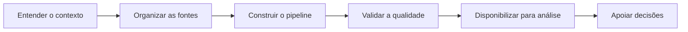

# Sarah Zanardi

### Data Engineer · Analytics · BI

**Transformo dados em bases confiáveis para decisões melhores.**

 

> Engenharia de Dados com visão de negócio: da fonte ao insight, com qualidade, clareza e propósito.

## Como posso contribuir

<table>
  <tr>
    <td width="50%" valign="top">
      <h3>⚙️ Construção</h3>
      
Pipelines ETL/ELT, integração, transformação e automação de dados.

    </td>
    <td width="50%" valign="top">
      <h3>🧱 Organização</h3>
      
Data Lake, Data Warehouse, modelagem dimensional e estruturas analíticas.

    </td>
  </tr>
  <tr>
    <td width="50%" valign="top">
      <h3>✅ Confiabilidade</h3>
      
Qualidade, validação, documentação e rastreabilidade para dados mais seguros.

    </td>
    <td width="50%" valign="top">
      <h3>📊 Impacto</h3>
      
KPIs, Analytics e BI conectados às necessidades reais do negócio.

    </td>
  </tr>
</table>

## Meu jeito de trabalhar

```mermaid
flowchart LR
    A[Entender o contexto] --> B[Organizar as fontes]
    B --> C[Construir o pipeline]
    C --> D[Validar a qualidade]
    D --> E[Disponibilizar para análise]
    E --> F[Apoiar decisões]
```

## Stack

  
<strong>Ver tecnologias</strong>

### Linguagens

### Cloud e plataformas de dados

### Analytics

## O que valorizo

`Clareza` · `Qualidade` · `Automação` · `Documentação` · `Escalabilidade` · `Colaboração`

## Em uma frase

Construo soluções de dados **confiáveis, escaláveis e fáceis de consumir**, aproximando tecnologia, análise e negócio.

### Vamos conversar?

Se você trabalha com dados, engenharia ou transformação digital, [fale comigo no LinkedIn](https://www.linkedin.com/in/sarah-zanardi-). 
Você também pode [explorar meus projetos](https://github.com/SarahZanardi).

